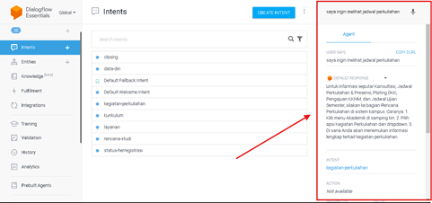

<h1 align="center">Chatbot Layanan Kampus Universitas Padjadjaran</h1>

<p align="center">
  
</p>

## Deskripsi Proyek
Proyek ini adalah chatbot yang dirancang untuk memberikan informasi terkait layanan kampus di Universitas Padjadjaran. Chatbot ini memanfaatkan **Dialogflow** untuk pemrosesan bahasa alami dan **Dialogflow Messenger** untuk integrasi dengan website demo. Fitur chatbot ini meliputi informasi terkait cara mengakses KRS, status her-registrasi, kegiatan perkuliahan, dan layanan akademik lainnya.

Demo chatbot ini dapat langsung diakses melalui website berikut:  
[Chatbot Layanan Kampus - Universitas Padjadjaran](https://s4njuuu3291.github.io/chatbot-layanan-kampus/)

## Penjelasan Mengenai Dialogflow


Chatbot ini menggunakan **Dialogflow** sebagai platform untuk pemrosesan bahasa alami (NLP). **Dialogflow** memungkinkan chatbot untuk mengenali dan memproses teks masukan dari pengguna, serta memberikan respons yang relevan berdasarkan pengaturan yang telah dibuat dalam **intents** dan **entities**.

<p align="center">
  
</p>

### Bagaimana Dialogflow Bekerja pada Chatbot Ini?
1. **Intents**: Setiap percakapan dengan chatbot dimulai dengan pencocokan intent, yaitu tujuan atau niat pengguna. Misalnya, jika pengguna ingin mengetahui bagaimana cara melihat KRS, maka chatbot akan mencari intent yang relevan yang berisi informasi tersebut. Dalam proyek ini, intents telah ditetapkan secara manual di Dialogflow untuk mencocokkan pertanyaan umum tentang layanan kampus seperti "cara melihat KRS", "status her-registrasi", dll.

   

   *Intent-intent yang digunakan.*

2. **Entities**: Entities adalah data atau informasi yang dapat diproses lebih lanjut dari percakapan. Sebagai contoh, chatbot dapat mengenali kata-kata seperti "biodata" atau "profil saya" sebagai entities untuk memberikan respons yang lebih tepat.

   

   *Entity data diri*

3. **Dialogflow Messenger**: Untuk mengintegrasikan chatbot ke dalam website, digunakan **Dialogflow Messenger**, yang memungkinkan pengguna berinteraksi dengan chatbot melalui antarmuka web. Dialogflow Messenger bertanggung jawab untuk mengirimkan pesan ke Dialogflow dan menampilkan respons dari chatbot ke pengguna.

   

   *Dialogflow messenger, dimana menyisipkan iframe ke dalam file html untuk menampilkan chatbotnya*

4. **Fungsi Webhook (Opsional)**: Untuk pengembangan lebih lanjut, **webhook** dapat diintegrasikan untuk menghubungkan chatbot dengan API eksternal, seperti sistem akademik untuk menarik data secara real-time. Namun, untuk saat ini, chatbot hanya mengandalkan informasi statis yang telah dimasukkan secara manual.

Dengan menggunakan Dialogflow, chatbot ini dapat menangani percakapan sederhana dan memberikan respons yang sesuai dengan pertanyaan pengguna, meskipun terbatas pada informasi yang telah dimasukkan secara manual.

### Mengelola Dialogflow
1. **Menambahkan Intent Baru**: Untuk menambah pertanyaan dan respons, cukup buat intent baru di konsol Dialogflow dan tentukan bagaimana chatbot akan merespons input pengguna.

    
   
2. **Menggunakan Entities**: Gunakan entities untuk menangkap nilai tertentu dalam percakapan, seperti tanggal atau status, agar chatbot dapat memberikan respons yang lebih tepat.

    

3. **Pengujian**: Chatbot dapat diuji langsung di konsol Dialogflow untuk memastikan respons yang diberikan sudah sesuai dengan yang diharapkan.

    

Untuk informasi lebih lanjut mengenai penggunaan Dialogflow, kunjungi [dokumentasi resmi Dialogflow](https://cloud.google.com/dialogflow/docs).

## Keterbatasan
- Chatbot ini hanya memberikan **informasi statis** yang telah dimasukkan secara manual ke dalam Dialogflow.
- **Tidak memiliki akses API** untuk menarik data secara langsung dari sistem akademik kampus (PACIS). Oleh karena itu, informasi yang diberikan bersifat umum dan tidak dapat diperoleh secara real-time dari sistem kampus.
- Chatbot hanya dapat memberikan arahan seperti: "Untuk melihat KRS, buka tab KRS di sistem akademik."

## Instalasi dan Penggunaan di Local
Untuk mengembangkan atau menjalankan chatbot ini secara lokal, ikuti langkah-langkah berikut:

1. **Clone repositori ini**:

   ```bash
   git clone https://github.com/S4njuuu3291/chatbot-layanan-kampus.git
   ```

2. **Masuk ke dalam folder proyek**:
   
   ```bash
   cd chatbot-layanan-kampus
   ```

3. **Jalankan `index.html`** di browser untuk melihat chatbot berfungsi.

## Kontribusi
Untuk berkontribusi pada proyek ini, ikuti langkah-langkah berikut:
1. **Fork repositori ini** ke akun GitHub.
2. **Buat cabang baru** untuk fitur atau perbaikan yang ingin ditambahkan.
3. **Lakukan perubahan dan uji coba** untuk memastikan fungsionalitas berjalan dengan baik.
4. **Kirim pull request** dengan perubahan yang telah dilakukan.

## **Kontak**
Proyek ini dibuat oleh Saya :). Jika ada pertanyaan atau saran, hubungi saya melalui:
- LinkedIn: [Sanjukin Pinem](https://www.linkedin.com/in/sanjukin-pinem-55bb45330/)
- Email: sanju329121@gmail.com

---